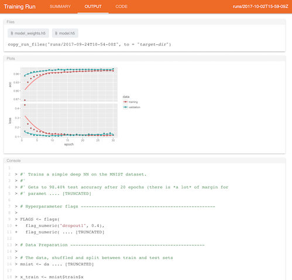

```{r setup, include=FALSE}
knitr::opts_chunk$set(eval = FALSE)
```

## Run Output

Any graphical or console output as well as file artifacts created by a training run (e.g. saved models or saved model weights) can be viewed from the **Output** tab of the run view:

<kbd></kbd>

You can use the `copy_run_files()` function to export file artifacts from runs into another directory. For example:

```{r}
copy_run_files("runs/2017-09-24T10-54-00Z", to = "saved-model")
```

You can also use the `copy_run()` function to export a run directory in it's entirety. For example, this code exports the specified run to a "best-run" directory:

```{r}
copy_run("runs/2017-09-24T10-54-00Z", to = "best-run")
```

Note that `copy_run()` will accept any number of runs. For example, this code exports all run directories with an evaluation accuracy greater than 0.98 to a "best-runs" directory:

```{r}
copy_run(ls_runs(eval_acc >= 0.98), to = "best-runs")
```

## Cleaning Runs

You can use the `clean_runs()` function to archive a set of runs you no longer need the data from. For example, this code archives all runs with an eval accuracy less than 0.98:

```{r}
clean_runs(ls_runs(eval_acc < 0.98))
```

If you don't specify a set of runs to clean then all runs will be archived:

```{r}
clean_runs() # archives all runs in the "runs" directory
```

Note that you'll always get a confirmation prompt before the runs are actually archived.

## Purging Runs

When runs are archived they are moved to the "archive" subdirectory of the "runs" directory. If you want to permanently remove runs from the archive you call the `purge_runs()` function:

```{r}
purge_runs()
```


