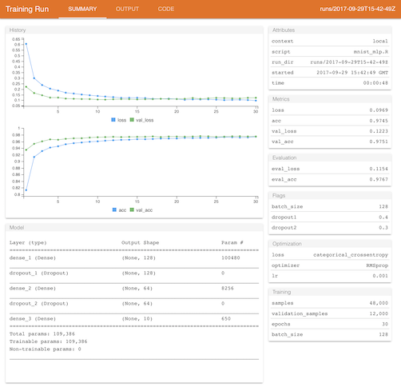
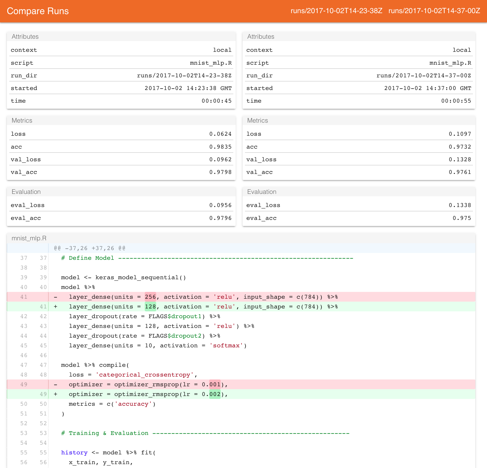
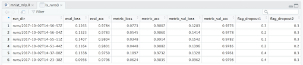
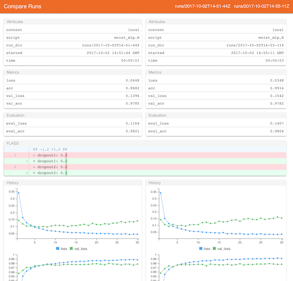
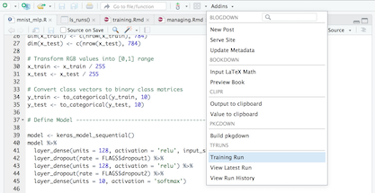
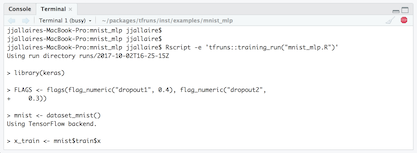
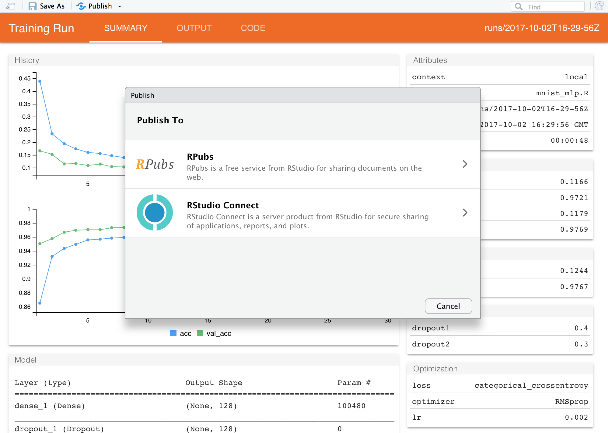

```{r setup, include=FALSE}
knitr::opts_chunk$set(eval = FALSE)
```




The **tfruns** package provides a suite of tools for tracking, visualizing, and managing TensorFlow training runs and experiments from R:

- Track the hyperparameters, metrics, output, and source code of every training run.

- Compare hyperparmaeters and metrics across runs to find the best performing model.

- Automatically generate reports to visualize individual training runs or comparisons between runs. 

- No changes to source code required (run data is automatically captured for all Keras and TF Estimator models).

## Installation

You can install the **tfruns** package from CRAN as follows:

```{r}
install.packages("tfruns")
```

The package is intended to be used with the [keras](https://tensorflow.rstudio.com/keras/) and/or the [tfestimators](https://tensorflow.rstudio.com/keras/) packages, both of which provide higher level interfaces to TensorFlow from R. These packages can be installed with:

```{r}
install.packages("keras")
install.packages("tfestimators")
```

## Training

In the following sections we'll describe the various capabilities of **tfruns**. Our example training script ([mnist_mlp.R](https://github.com/rstudio/tfruns/blob/master/inst/examples/mnist_mlp/mnist_mlp.R)) trains a Keras model to recognize MNIST digits.

To train a model with **tfruns**, just use the `training_run()` function in place of the `source()` function to execute your R script. For example:

```{r}
library(tfruns)
training_run("mnist_mlp.R")
```

When training is completed, a summary of the run will automatically be displayed if you are within an interactive R session:

<kbd></kbd>

The metrics and output of each run are automatically captured within a *run directory* which is unique for each run that you initiate. Note that for Keras and TF Estimator models this data is captured automatically (no changes to your source code are required).

You can call the `latest_run()` function to view the results of the last run (including the path to the run directory which stores all of the run's output):

```{r}
latest_run()
```
```
$ run_dir           : chr "runs/2017-10-02T14-23-38Z"
$ eval_loss         : num 0.0956
$ eval_acc          : num 0.98
$ metric_loss       : num 0.0624
$ metric_acc        : num 0.984
$ metric_val_loss   : num 0.0962
$ metric_val_acc    : num 0.98
$ flag_dropout1     : num 0.4
$ flag_dropout2     : num 0.3
$ samples           : int 48000
$ validation_samples: int 12000
$ batch_size        : int 128
$ epochs            : int 20
$ epochs_completed  : int 20
$ metrics           : chr "(metrics data frame)"
$ model             : chr "(model summary)"
$ loss_function     : chr "categorical_crossentropy"
$ optimizer         : chr "RMSprop"
$ learning_rate     : num 0.001
$ script            : chr "mnist_mlp.R"
$ start             : POSIXct[1:1], format: "2017-10-02 14:23:38"
$ end               : POSIXct[1:1], format: "2017-10-02 14:24:24"
$ completed         : logi TRUE
$ output            : chr "(script ouptut)"
$ source_code       : chr "(source archive)"
$ context           : chr "local"
$ type              : chr "training"
```

The run directory used in the example above is "runs/2017-10-02T14-23-38Z". Run directories are by default generated within the "runs" subdirectory of the current working directory, and use a timestamp as the name of the run directory. You can view the report for any given run using the `view_run()` function:

```{r}
view_run("runs/2017-10-02T14-23-38Z")
```

## Comparing Runs

Let's make a couple of changes to our training script to see if we can improve model performance. We'll change the number of units in our first dense layer to 128, change the `learning_rate` from 0.001 to 0.003 and run 30 rather than 20 `epochs`. After making these changes to the source code we re-run the script using `training_run()` as before:

```{r}
training_run("mnist_mlp.R")
```

This will also show us a report summarizing the results of the run, but what we are really interested in is a comparison between this run and the previous one. We can view a comparison via the `compare_runs()` function:

```{r}
compare_runs()
```

<kbd></kbd>

The comparison report shows the model attributes and metrics side-by-side, as well as differences in the source code and output of the training script. 

Note that `compare_runs()` will by default compare the last two runs, however you can pass any two run directories you like to be compared.

## Analyzing Runs

We've demonstrated visualizing and comparing one or two runs, however as you accumulate more runs you'll generally want to analyze and compare runs many runs. You can use the `ls_runs()` function to yield a data frame with summary information on all of the runs you've conducted within a given directory:

```{r}
ls_runs()
```
```
Data frame: 4 x 28 
                    run_dir eval_loss eval_acc metric_loss metric_acc metric_val_loss metric_val_acc
1 runs/2017-12-09T21-01-11Z    0.1485   0.9562      0.2577     0.9240          0.1482         0.9545
2 runs/2017-12-09T21-00-11Z    0.1438   0.9573      0.2655     0.9208          0.1505         0.9559
3 runs/2017-12-09T19-59-44Z    0.1407   0.9580      0.2597     0.9241          0.1402         0.9578
4 runs/2017-12-09T19-56-48Z    0.1437   0.9555      0.2610     0.9227          0.1459         0.9551
# ... with 21 more columns:
#   flag_batch_size, flag_dropout1, flag_dropout2, samples, validation_samples, batch_size,
#   epochs, epochs_completed, metrics, model, loss_function, optimizer, learning_rate, script,
#   start, end, completed, output, source_code, context, type
```

You can also render a sortable, filterable version all of the columns within RStudio using the `View()` function:

```{r}
View(ls_runs())
```

<kbd></kbd>

The `ls_runs()` function also supports `subset` and `order` arguments. For example, the following will yield all runs with an eval accuracy better than 0.98:

```{r}
ls_runs(eval_acc > 0.9570, order = eval_acc)
```
```
Data frame: 2 x 28 
                    run_dir eval_acc eval_loss metric_loss metric_acc metric_val_loss metric_val_acc
1 runs/2017-12-09T19-59-44Z   0.9580    0.1407      0.2597     0.9241          0.1402         0.9578
2 runs/2017-12-09T21-00-11Z   0.9573    0.1438      0.2655     0.9208          0.1505         0.9559
# ... with 21 more columns:
#   flag_batch_size, flag_dropout1, flag_dropout2, samples, validation_samples, batch_size,
#   epochs, epochs_completed, metrics, model, loss_function, optimizer, learning_rate, script,
#   start, end, completed, output, source_code, context, type
```

You can pass the results of `ls_runs()` to compare runs (which will always compare the first two runs passed). For example, this will compare the two runs that performed best in terms of evaluation accuracy:

```{r}
compare_runs(ls_runs(eval_acc > 0.9570, order = eval_acc))
```

<kbd></kbd>

## RStudio IDE

If you use RStudio with **tfruns**, it's strongly recommended that you use RStudio v1.1 or higher, as there are are a number of points of integration with the IDE that require this newer releases.

### Addin

The **tfruns** package installs an RStudio IDE addin which provides quick access to frequently used functions from the Addins menu:

<kbd></kbd>

Note that you can use **Tools** -> **Modify Keyboard Shortcuts** within RStudio to assign a keyboard shortcut to one or more of the addin commands. 

### Background Training

RStudio v1.1 includes a Terminal pane alongside the Console pane. Since training runs can become quite lengthy, it's often useful to run them in the background in order to keep the R console free for other work. You can do this from a Terminal as follows:

<kbd></kbd>

If you are not running within RStudio then you can of course use a system terminal window for background training.

### Publishing Reports

Training run views and comparisons are HTML documents which can be saved and shared with others. When viewing a report within RStudio v1.1 you can save a copy of the report or publish it to RPubs or RStudio Connect:

<kbd></kbd>

If you are not running within RStudio then you can use the `save_run_view()` and `save_run_comparison()` functions to create standalone HTML versions of run reports.


## Hyperparameter Tuning

Tuning a model often requires exploring the impact of changes to many hyperparameters. The best way to approach this is generally to systematically train over the combinations of those parameters to determine which combination yields the best model. See the [Hyperparmeter Tuning](https://tensorflow.rstudio.com/tools/tfruns/articles/tuning.html) article for details on how to accomplish this with tfruns.

## Managing Runs

There are a variety of tools available for managing training run output, including:

1) Exporting run artifacts (e.g. saved models).

2) Copying and purging run directories.

3) Using a custom run directory for an experiment or other set of related runs.

The [Managing Runs](https://tensorflow.rstudio.com/tools/tfruns/articles/managing.html) article provides additional details on using these features.


